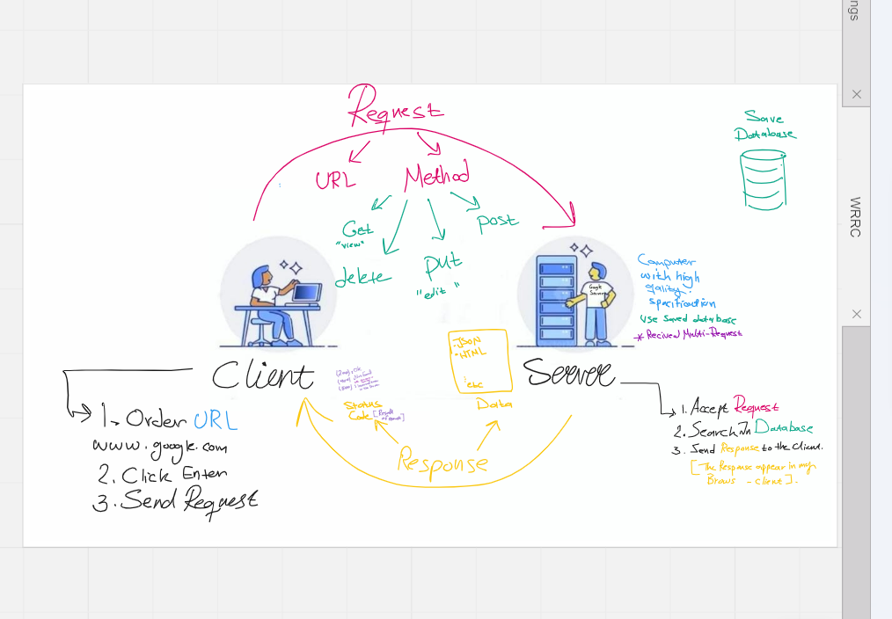
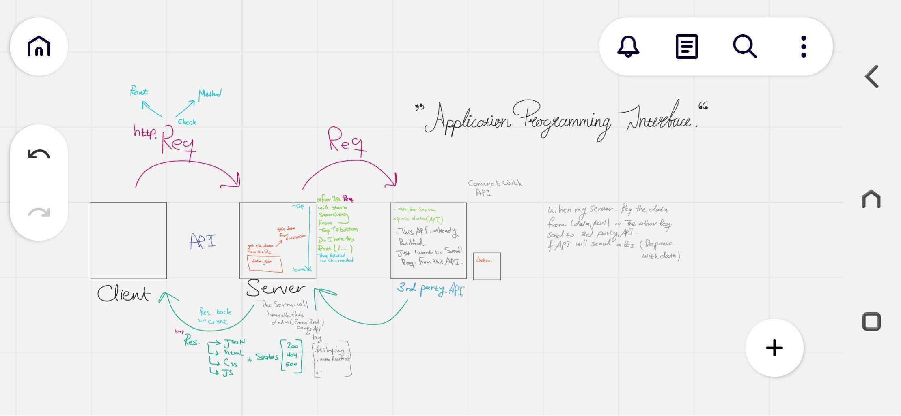
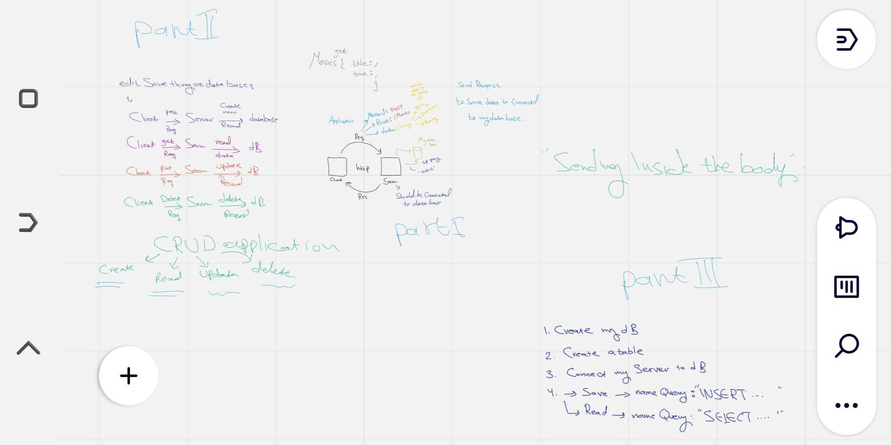

# Movies-Library

# Movie Application - Project Version 1.7

**Author Name**: LeeNa A.AlZaben

## Installation

To install this project on your local machine, follow these steps:

1. Clone the repository by git clone
2. Install the dependencies by npm install

## Usage
Follow these steps to use this project
1. Get your Movie DB API key from documentation this website "themoviedb"
2. Set your API key by select API from your setting.
3. Start the server ==> $ npm start .
## API Documentation
This project includes the following API endpoint:
1. Home page.
2. Favorite Movie.
3. Whice one is the Trending.
4. Search between Movie.
5. popular one.
6. Overview.

## WRRC

## License
This project is licensed so see the LICENSE file for more details.
## Acknowledgements
This project was created using the following open-source tools:
1. Node.js: https://nodejs.org/
2. Express.js: https://expressjs.com/
3. Axios.
4. Movie data base API.

## Overview

This project for create Page with two Endpoints the Home page ( with "/") and the other for
("/favorite") on Favorite Page with the GET request using the provided JSON data.
Trending movies applications can have a variety of features, including the ability to search for movies, filter by genres or release date, create watchlists.
And receive notifications when new movies are added to the trending list.
<!-- Trending movies -->

<!--  Search on movie -->

<!-- create watchlists -->
<!-- new trend list -->

## Getting Started
<!-- What are the steps that a user must take in order to build this app on their own machine and get it running? -->
1. Once you have installed the Express framework
"$ npm install express " and required inside the express.
2. create a server file server.js :
3. Used ==> const express = require('express');  to import the Express framework into my Node.js application.
4. And Use 'express()' to create a new instance of an Express application and call it in another variable apps.
5. Run the server and make it listen all the time for incoming requests using the app.listen() method.

## Project Features
<!-- What are the features included in you app -->
1. Basic server setup with Express framework.
2. Home page endpoint that returns a JSON object with movie data.
3. Movie data is stored locally in the server.
4. User interface to display movie data is not yet implemented.
