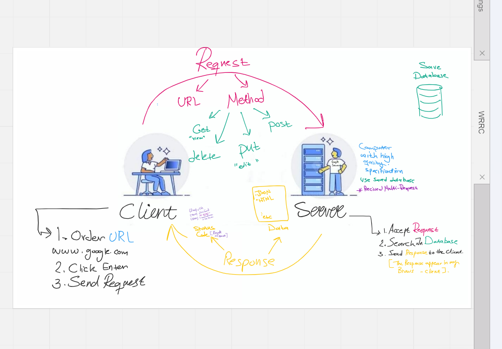

# Movies-Library

# Movie Application - Project Version 1.7

**Author Name**: LeeNa A.AlZaben

## WRRC

## Overview

This project for create Page with two Endpoints the Home page ( with "/") and the other for
("/favorite") on Favorite Page with the GET request using the provided JSON data.

## Getting Started
<!-- What are the steps that a user must take in order to build this app on their own machine and get it running? -->
1. Once you have installed the Express framework
"$ npm install express " and required inside the express.
2. create a server file server.js :
3. Used ==> const express = require('express');  to import the Express framework into my Node.js application.
4. And Use 'express()' to create a new instance of an Express application and call it in another variable apps.
5. Run the server and make it listen all the time for incoming requests using the app.listen() method.

## Project Features
<!-- What are the features included in you app -->
1. Basic server setup with Express framework.
2. Home page endpoint that returns a JSON object with movie data.
3. Movie data is stored locally in the server.
4. User interface to display movie data is not yet implemented.
